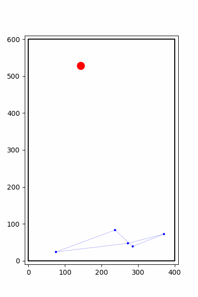

# MARL Distributed Formation
Source Code for the Paper: "Enhanced Formation Control in Multi-Agent Systems through Localized Reinforcement Learning"



```bash
# recommended environment: python 3.8
pip install -r requirements.txt

# to play around in the 2D environment with keyboard while checking the action, observation, reward, dones
# (move with arrow keys, use numbers to change the agent being controlled)
python keyboard_move.py

# try out the baseline controller
python simulate.py

# train policy (if the parameters aren't specified the default value in cfg/config.yaml are used)
python vectorized_env.py name=my_name num_agents_per_formation=5

# see trained policy in 2D env (it will show the policy with the largest numerical value in the logs/[my_name] directory)
python visualize_policy.py name=my_name
```